# 🚲📊 Bike Sharing Demand Prediction (Regression Machine Learning Model)
Machine Learning & AI Pipeline by **Sahil Verma**  
Built using **A.I-enhanced Machine Learning techniques** for modeling, analysis, and visualization.  

  
  
  
  
  
  

---

## 📘 Project Overview  
This project builds an **AI-powered Linear Regression system** for **Bike Sharing Companies**.  
The aim is to **predict daily demand for shared bikes** based on **environmental, seasonal, and calendar-based features**, and provide **actionable business insights**.  

The pipeline covers everything from **data quality checks, exploratory data analysis (EDA), feature engineering, dummy variable creation** to **model building, evaluation, residual validation, and interpretation**.  
The final output is a **Bike Demand Prediction Model**, plus **business dashboards and recommendations** to improve **fleet management, operations, and pricing strategies**.  

---

## 📈 Visualizations  

✅ Seasonal Rentals Distribution  
👉

✅ Weather-wise Demand Patterns  
👉

✅ Predicted vs Actual Demand Comparison  
👉

✅ Residual Analysis Dashboard (Residuals, QQ Plot, Distribution)  
👉

✅ Regression Coefficients & VIF Dashboard  
👉

---

## 🧠 A.I Workflow  

```mermaid
graph TD
A[Data Collection] --> B[Data Quality Checks]
B --> C[EDA & Visualization]
C --> D[Feature Engineering & Dummy Variables]
D --> E[Train-Test Split]
E --> F[Model Building - Linear Regression]
F --> G[Model Evaluation - R², RMSE, MAE]
G --> H[Residual Analysis & Validation]
H --> I[Insights & Business Recommendations]
```

## 🎯 Project Goals  

- Perform Data Quality Checks (missing values, duplicates, outliers).  
- Convert categorical codes into business-friendly categories (Season, Weather).  
- Conduct Exploratory Data Analysis with interactive gradient visuals.  
- Create dummy variables & perform train-test split.  
- Build a Multiple Linear Regression Model using Statsmodels + Scikit-Learn.  
- Evaluate performance using R², Adjusted R², RMSE, MAE.  
- Validate assumptions with Residual Analysis & QQ plots.  
- Identify significant predictors of bike demand.  
- Deliver business-ready insights & dashboards.  

---

## 📑 Project Workflow  

| Task   | Objective                                   | Deliverables                                |
|--------|---------------------------------------------|---------------------------------------------|
| Task 1 | Import Libraries & Load Dataset             | Dataset preview, styled tables              |
| Task 2 | Data Quality Checks & Categorical Conversion| Clean dataset, category mapping, dashboards |
| Task 3 | Exploratory Data Analysis (EDA)             | Gradient visuals, correlations, distributions|
| Task 4 | Dummy Variables & Train-Test Split          | Encoded dataset, split 80/20                |
| Task 5 | Build Linear Regression Model               | Regression summary, VIF, coefficients       |
| Task 6 | Model Evaluation                            | Metrics table, Predicted vs Actual plots    |
| Task 7 | Residual Analysis & Validation              | Residuals, QQ plot, distribution dashboard |
| Task 8 | Interpretation & Insights                   | Business implications & recommendations     |

---

## ⚙️ Tools & Technologies Used  

| Category       | Tools / Libraries |
|----------------|-------------------|
| Language       | Python |
| Data Analysis  | Pandas, NumPy |
| Visualization  | Plotly, Matplotlib, Seaborn |
| Machine Learning | Scikit-learn (Linear Regression), Statsmodels |
| Documentation  | Jupyter Notebook, Markdown, Word (.docx), PowerPoint (PPT) |

---

## 📊 Key Evaluation Metrics  

| Metric        | Business Meaning                          | Result       |
|---------------|-------------------------------------------|--------------|
| 📈 R²         | Variance in rentals explained by the model | ~0.83 (ex.) |
| 📊 Adjusted R²| Adjusted for # of predictors              | ~0.82 (ex.) |
| 📉 RMSE       | Avg. prediction error (bike counts)        | ~700 (ex.)  |
| ⚖️ MAE        | Robust avg. error magnitude               | ~500 (ex.)  |

👉 Replace with your actual model results from Task 6 output.  

---

## 🔑 Business Insights  

- 🌸 **Seasonality Matters** → Bike demand peaks in Summer ☀️ and Fall 🍂, drops in Winter ❄️.  
- ☁️ **Weather Influence** → Rentals reduce sharply during Rain/Snow ⛈️.  
- 🏢 **Working Days Drive Demand** → Higher rentals on weekdays vs holidays.  
- 🔥 **Temperature & Humidity** → Key continuous predictors of demand.  

📍 (Regression Coefficients & Feature Importance PNG here)

---

## 💡 Key Business Recommendations  

- 🚲 **Fleet Management** → Allocate more bikes in high-demand months (Summer/Fall).  
- 🌦️ **Dynamic Operations** → Adjust inventory and staffing during adverse weather.  
- 🎉 **Holiday Promotions** → Boost demand during holidays via pricing/marketing offers.  
- 🏙️ **Urban Planning** → Support sustainable mobility through demand-driven insights.  

---

## ✅ Key Challenges & Solutions  

| Challenge                  | Impact                              | Solution Implemented                       |
|----------------------------|-------------------------------------|--------------------------------------------|
| Multicollinearity in predictors | Misleading regression coefficients | Applied VIF analysis, removed redundant features |
| Outliers in demand data    | Skewed regression results           | Applied z-score inspection + boxplots       |
| Overfitting risk           | Poor generalization                 | Compared train/test metrics, validated residuals |
| Visualization readability  | Hard for business users             | Designed gradient interactive dashboards    |

---

## 🙋 Author  

**Name:** Sahil Verma  
**Role:** Data Analyst & Machine Learning Enthusiast  
**Focus:** Building professional-grade, explainable AI/ML models with actionable insights.
